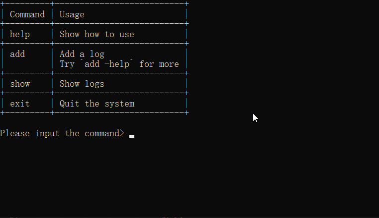

# RewardOrPunishYourself

奖惩自己，如果做得好就奖励自己金币，做得不好（没管住自己看了1h的番）扣除自己的金币。让奖励变成习惯。

简单小[脚本](PythonScript/main.py)，记录自己今日的自律

+ 项目地址：[https://github.com/LetMeFly666/RewardOrPunishYourself](https://github.com/LetMeFly666/RewardOrPunishYourself)
+ 在线地址：[RewardOrPunish.LetMeFly.xyz/](https://rewardorpunish.letmefly.xyz/)

## Demo



## TODO

1. 暂不支持```add```的一行命令
2. 可上线网页版
